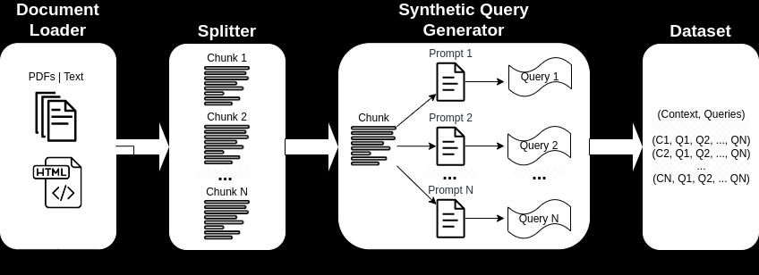

<h1 align="center">
  <!-- <a href="https://github.com/mddunlap924/VHSpy">
    
  </a> -->
  Prompting Large Language Models (LLM)
</h1>

<p align="center">This repository provides sample LLM prompts tailored for generating synthetic queries used to evaluate an Information Retrieval system.
</p> 

<p align="center">
<a href="#introduction">Introduction</a> &nbsp;&bull;&nbsp;
<a href="#background">Background</a> &nbsp;&bull;&nbsp;
<a href="#benefits">Benefits</a> &nbsp;&bull;&nbsp;
<a href="#prompt-templates">Prompt Templates</a> &nbsp;&bull;&nbsp;
<a href="#example-notebooks">Example Notebooks</a> &nbsp;&bull;&nbsp;
<a href="#issues">Issues</a> &nbsp;&bull;&nbsp;
<a href="#todos">TODOs</a>
</p>

<p align="center">
  <a target="_blank" href="https://www.linkedin.com/in/myles-dunlap/">
  </a>
  <a target="_blank" href="https://www.kaggle.com/dunlap0924">
  </a>
  <a target="_blank" href="https://scholar.google.com/citations?user=ZpHuEy4AAAAJ&hl=en">
  </a>
</p>

# Introduction
Large language models (LLMs) have transformed Information Retrieval (IR) and search by comprehending complex queries. This repository showcases prompt templates designed for generating sophisticated synthetic queries when provided context. An example context-query pair is shown below:
```
CONTEXT: 
Pure TalkUSA is an American mobile virtual network operator headquartered in Covington, Georgia, United States. 
It is most notable for an industry-first offering of rollover data in their data add-on packages, which has since been discontinued. 
Pure TalkUSA is a subsidiary of Telrite Corporation. Bring Your Own Phone! 

QUERY: 
What was the outstanding service offered by Pure TalkUSA?
```

When building an IR or Retrieval Augmented Generation (RAG) system, a dataset of context and queries is vital for evaluating the system's ranking effectiveness with custom documents. The retriever, a crucial component, offers various options like embedding models, sparse vs. dense vs. hybrid retrieval methods, and re-rankers. Understanding how to select these components is essential. Creating an evaluation dataset for the retriever is the initial step in this process [[Source]](https://blog.llamaindex.ai/boosting-rag-picking-the-best-embedding-reranker-models-42d079022e83).

By employing LLM prompt engineering, a diverse range of synthetic queries can be generated to form a dataset. Figure 1 outlines the process, transforming custom documents into a Dataset for evaluating IR or RAG systems. The repository showcases the Synthetic Query Generator process, emphasizing [zero-shot and few-shot prompting](https://openreview.net/pdf?id=gmL46YMpu2J#:~:text=Importantly%2C%20the%20few%2Dshot%20examples,highly%20efficient%20dual%20encoder%20models.) for creating highly customizable synthetic query datasets.

<p align="center"> 
    
    <br>
    Figure 1: Process of Synthetic Query Generation to create a Dataset for evaluating IR ranking
</p>

# Background
The primary function of an IR system is retrieval, which aims to determine the relevance between a users' query and the content to be retrieved. Implementing an IR or RAG system demands user-specific documents. However, lacking corresponding queries hampers system evaluation. Figure 2 provides an overview of the RAG process for a question-answering system.  

<p align="center"> 
    
    <br>
    Figure 2: RAG process overview <a href="https://blog.gopenai.com/enrich-llms-with-retrieval-augmented-generation-rag-17b82a96b6f0">[Source]</a>.
</p>

This repository concentrates on creating a synthetic context-query dataset. This dataset is crucial for evaluating the Information Retrieval (IR) process illustrated in Figure 2, Step #2. By allowing offline evaluation, it enables a thorough analysis of an IR systems' balance between speed and accuracy, informing necessary revisions. Referencing Figure 3, a detailed exploration of LLM-based IR systems is shown. 
<p align="center"> 
    
    <br>
    Figure 3: LLMs can be used in query rewriter, retriever, reranker, and reader <a href="https://arxiv.org/pdf/2308.07107.pdf">[Source]</a>
</p>

As shown their are several steps in the IR task and solutions can range in complexity from traditional methods (e.g., term-based sparse methods) to neural based methods (e.g., embeddings and LLMs). Evaluation of IR systems is critical to making well-informed design decisions. From search to recommendations, evaluation measures are paramount to understanding what does and does not work in retrieval. Figure 5 shows common evaluation metrics for IR and the `Dataset` from Figure 1 can be used for the `Offline Metrics` shown in Figure 5.

<p align="center"> 
    
    <br>
    Figure 4: Ranking evaluation metrics <a href="https://www.pinecone.io/learn/offline-evaluation/">[Source]</a>
</p>

`Offline metrics` are measured in an isolated environment before deploying a new IR system. These look at whether a particular set of relevant results are returned when retrieving items with the system [Source](https://www.pinecone.io/learn/offline-evaluation/").

# Benefits
A few key benefits of synthetic context-query data generation:
- `Customized IR Task Query Generation`: Prompting LLMs offer great flexibility in the types of queries that can be generated. This is helpful because IR tasks vary in their application. For example, [Benchmarking-IR (BEIR)](https://github.com/beir-cellar/beir) is a heterogeneous benchmark containing diverse IR tasks such as question-answering, argument or counter argument retrieval, fact checking, etc. Due to the diversity in IR tasks this is where the benefits of LLM prompting can excellence because the prompt can be tailored to generate synthetic data to the IR task. Figure 5 shows an overview of the diverse IR tasks and datasets in BEIR. Refer to the [BEIR leaderboard](https://eval.ai/web/challenges/challenge-page/1897/overview) to see the performance of NLP-based retrieval models.
<p align="center"> 
    
    <br>
    Figure 5: BEIR benchmark datasets and IR tasks Image taken from <a href="https://openreview.net/pdf?id=wCu6T5xFjeJ">[Source]</a>
</p>

- `Zero or Few-Shot Annotations`: In a technique referred to as [zero or few-shot prompting](https://blog.vespa.ai/improving-text-ranking-with-few-shot-prompting/), developers can provide domain-specific example queries to LLMs, greatly enhancing query generation. This approach often requires only a handful of annotated samples.
- `Longer Context Length`: GPT-based LLM models, like Llama2, provide extended context lengths, up to 4,096 tokens compared to BERT's 512 tokens. This longer context enhances document parsing and query generation control.

# Prompt Templates
[Llama2](https://github.com/facebookresearch/llama) will be used in this repository for generating synthetic queries because it can be ran locally on consumer grade GPUs. Shown below is the prompt template for [Llama2 Chat](https://github.com/facebookresearch/llama#fine-tuned-chat-models) which was fine-tuned for dialogue and instruction applications.
```
<s>[INST] <<SYS>>
{your_system_message}
<</SYS>>

{user_message_1} [/INST]
```
- **System Prompt**: A system prompt `<<SYS>>` is one of the unsung advantages of open-access models is that you have full control over the system prompt in chat applications. This is essential to specify the behavior of your chat assistant –and even imbue it with some personality–, but it's unreachable in models served behind APIs [Source](https://huggingface.co/blog/llama2).
- **User Message**: The query or message provided by the user. The [INST] and [/INST] help identify what was typed by the user so Llama knows how to respond properly. Without these markers around the user text, Llama may get confused about whose turn it is to reply.

Note that base Llama2 models have no prompt structure because they are raw non-instruct tuned models [Source](https://gpus.llm-utils.org/llama-2-prompt-template/#fn:1).

Additional resources and references to help with prompting techniques and basics:
- [LLaMA 2 - Every Resource you need](https://www.philschmid.de/llama-2#how-to-prompt-llama-2-chat)
- [Prompt Engineering Guide](https://www.promptingguide.ai/)
- [Llama2 Prompt Template](https://gpus.llm-utils.org/llama-2-prompt-template/#fn:1)
- In this repository refer to the directory [notes-references](./notes-references/README.md) for more details on `Prompt Engineering` and `Consistency Filtering`.

# Example Notebooks
### 1.) Question-Answering
Review this [Jupyter Notebook qa-gen-query](./notebooks/qa-gen-query.ipynb) for a working example of synthetic context-query data generation for custom datasets. This shows examples of prompting LLMs using `zero and few-shot annotations`.

### 2.) Argument Retrieval
Review this [Jupyter Notebook argument-gen-query](./notebooks/argument-gen-query.ipynb) for examples of synthetic context-query data for argument retrieval tasks. In the context of information retrieval, these tasks are designed to retrieve relevant arguments from various sources such as documents. In argument retrieval the goal is to provide users with persuasive and credible information to support their arguments or make informed decisions.

### 3.) Non-Llama Query Generation
Other examples of query specific generation models (e.g., `BeIR/query-gen-msmarco-t5-base-v1`) can readily be found online and at the below link(s):
- [BEIR Question Generation](https://github.com/beir-cellar/beir/wiki/Examples-and-tutorials#beers-question-generation)

Inferencing Llama-2 for query generation is shown in the below code snippet:
```python
# Tokenize the prompt
batch = tokenizer(prompt, return_tensors='pt')

# Generate the response from Llama2
response = model.generate(batch["input_ids"].cuda(),
                          do_sample=True,
                          top_k=50,
                          top_p=0.9,
                          temperature=0.6)
# Decode the response
decode_response = tokenizer.decode(response[0], skip_special_tokens=True)
```

# Issues
This repository is will do its best to be maintained. If you face any issue or want to make improvements please <a href="https://github.com/mddunlap924/llm-prompting/issues">raise an issue</a> or submit a Pull Request. :smiley:

# TODOs
- [ ] [DeepSpeed ZeRO-Inference](https://www.deepspeed.ai/2022/09/09/zero-inference.html) Offload massive LLM weights to non-GPU resources for running +70B models on consumer grade hardware.
- [ ] Feel free to raise an Issue for a feature you would like to see added.

#### Liked the work? Please give a star!