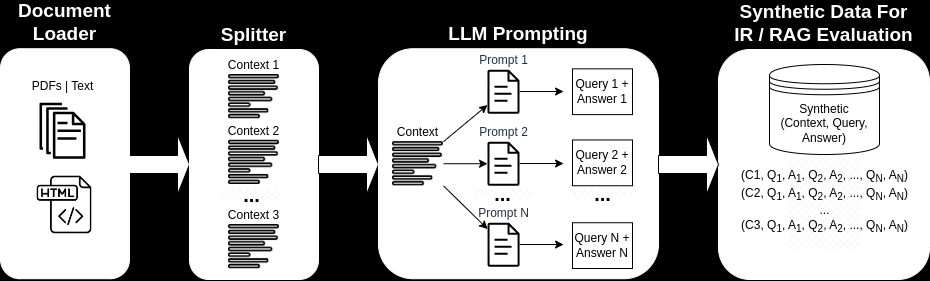
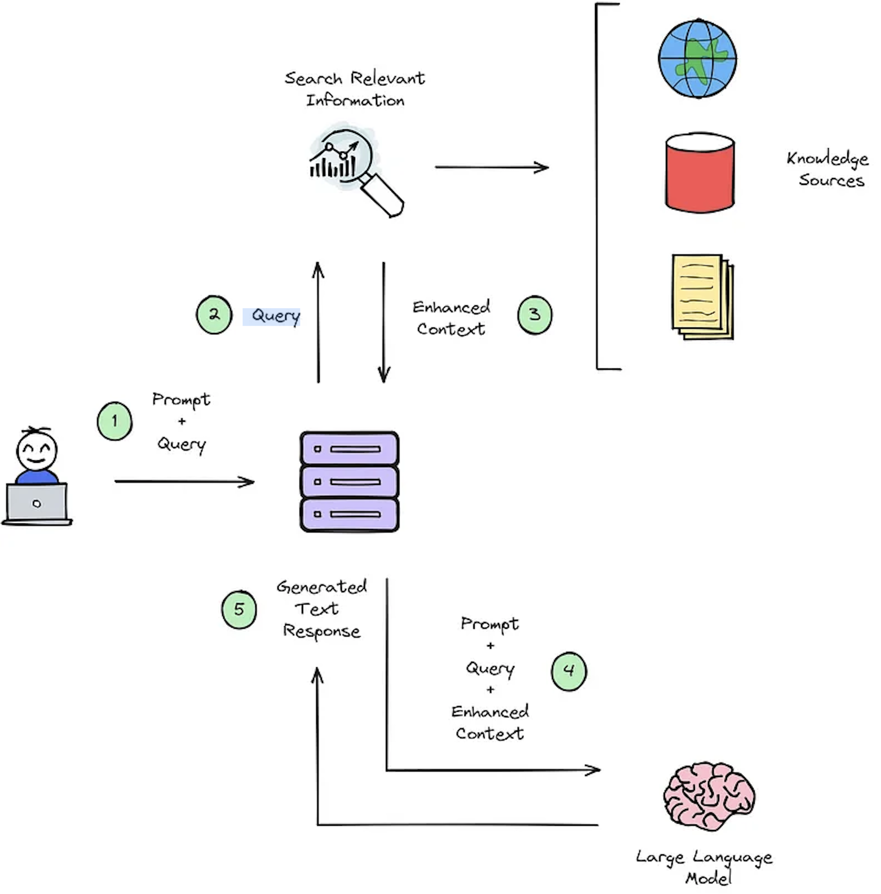
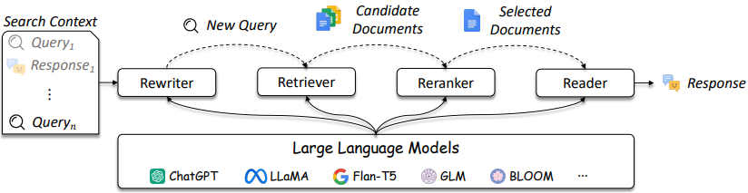
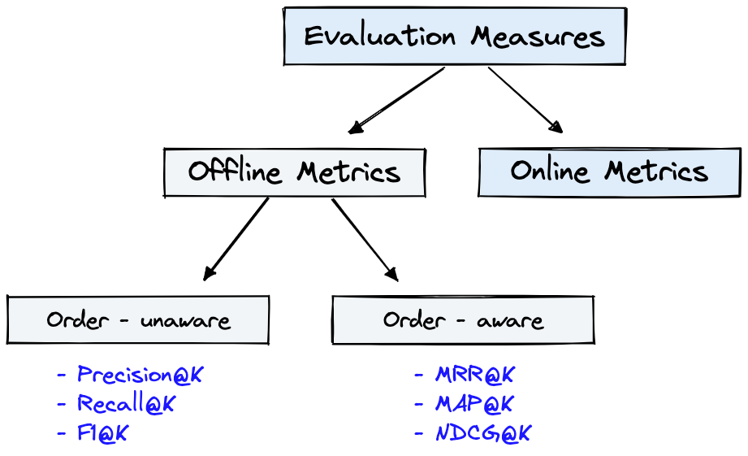
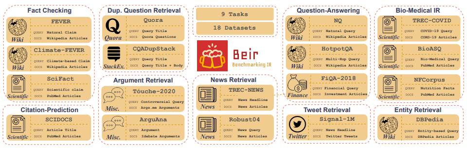

<h1 align="center">
  <!-- <a href="https://github.com/mddunlap924/VHSpy">
    
  </a> -->
  Synthetic Data Generation using LangChain for IR and RAG Evaluation
</h1>

<p align="center">This repository demonstrates LangChain, Llama2-Chat, and zero- and few-shot prompt engineering to enable synthetic data generation for Information Retrieval (IR) and Retrieval Augmented Generation (RAG) evaluation.
</p> 

<p align="center">
<a href="#introduction">Introduction</a> &nbsp;&bull;&nbsp;
<a href="#highlights">Highlights</a> &nbsp;&bull;&nbsp;
<a href="#example-notebooks">Example Notebooks</a> &nbsp;&bull;&nbsp;
<a href="#background">Background</a> &nbsp;&bull;&nbsp;
<a href="#metrics">Metrics</a> &nbsp;&bull;&nbsp;
<a href="#benefits">Benefits</a> &nbsp;&bull;&nbsp;
<a href="#prompt-templates">Prompt Templates</a> &nbsp;&bull;&nbsp;
<a href="#issues">Issues</a> &nbsp;&bull;&nbsp;
<a href="#todos">TODOs</a>
</p>

<p align="center">
  <a target="_blank" href="https://www.linkedin.com/in/myles-dunlap/">
  </a>
  <a target="_blank" href="https://www.kaggle.com/dunlap0924">
  </a>
  <a target="_blank" href="https://scholar.google.com/citations?user=ZpHuEy4AAAAJ&hl=en">
  </a>
</p>

# Introduction
Large language models (LLMs) have transformed Information Retrieval (IR) and search by comprehending complex queries. This repository showcases concepts and packages that can be used to generate sophisticated synthetic datasets for IR and Retrieval Augmented Generation (RAG) evaluation. 

The synthetic data generated is a query and answer for a given context. An example of a synthetically generated context-query-answer is shown below:
```
Provided Context (usually split from documents / text sources): 
Pure TalkUSA is an American mobile virtual network operator headquartered in Covington, Georgia, United States. 
It is most notable for an industry-first offering of rollover data in their data add-on packages, which has since been discontinued. 
Pure TalkUSA is a subsidiary of Telrite Corporation. Bring Your Own Phone! 

Synthetically Generated Query: 
What was the outstanding service offered by Pure TalkUSA?

Synthetically Generated Answer:
The outstanding service from Pure TalkUSA was its industry-first offering of rollover data.
```

When building an IR or RAG system, a dataset of context, queries, and answers is vital for evaluating the system's performance. Human-annotated datasets offer excellent ground truths but can be expensive and challenging to obtain; therefore, synthetic datasets generated using LLMs is an attractive solution and supplement. 

By employing LLM prompt engineering, a diverse range of synthetic queries and answers can be generated to form a robust validation dataset. This repository showcases a process to generate synthetic data while emphasizing [zero- and few-shot prompting](https://openreview.net/pdf?id=gmL46YMpu2J#:~:text=Importantly%2C%20the%20few%2Dshot%20examples,highly%20efficient%20dual%20encoder%20models.) for creating highly customizable synthetic datasets. Figure 1 outlines the synthetic dataset generation process demonstrated in this repository. 

<p align="center"> 
    
    <br>
    Figure 1: Synthetic Data Generation for IR and RAG Evaluation
</p>

**NOTE**: Refer to the [Background](#background) and [Metrics](#metrics) sections for a deeper dive on IR, RAG, and how to evaluate these systems.


# Highlights

A few of the key highlights in repository are:
- *Local LLM models on consumer grade hardware are exclusively used throughout* and no external API calls are performed. This is paramount for data privacy. Also, several online examples utilize external API calls to State-of-the-Art (SOTA) LLMs which generally provide higher quality results than local LLMs with less parameters. This causes certain challenges in coding and error handling for local models and solutions are shown here.
- [Zero- and Few-Shot Prompting](https://openreview.net/pdf?id=gmL46YMpu2J#:~:text=Importantly%2C%20the%20few%2Dshot%20examples,highly%20efficient%20dual%20encoder%20models.) for highly customizable query and answer generation are presented.
- [LangChain](https://python.langchain.com/docs/get_started/introduction) examples using:
  - Custom prompt engineering,
  - Output parsers and auto-fixing parsers to obtain structured data,
  - Batch GPU inference with chains,
  - LangChain Expression Language (LCEL).
- [Quantization](https://huggingface.co/blog/4bit-transformers-bitsandbytes) for reducing model size onto consumer grade hardware.


# Example Notebooks
## Context-Query-Answer Generation with LangChain
1.) **LangChain with Custom Prompts and Output Parsers for Structured Data Output**: see [gen-question-answer-query.ipynb](./notebooks/gen-question-answer-query.ipynb) for an example of synthetic context-query-answer data generation. Key aspects of this notebook are:
- [LangChain Custom Prompt Template](https://python.langchain.com/docs/modules/model_io/prompts/prompt_templates/custom_prompt_template) for a Llama2-Chat model
- [PydanticOutputParser](https://python.langchain.com/docs/modules/model_io/output_parsers/pydantic)
- [OutputFixingParser](https://python.langchain.com/docs/modules/model_io/output_parsers/output_fixing_parser)
- Custom output parser classes are written to accommodate Llama2-Chat and error handling. 

## Context-Query Generation with LangChain
1.) **LangChain Custom Llama2-Chat Prompting**: See [qa-gen-query-langchain.ipynb](./notebooks/qa-gen-query-langchain.ipynb) for an example of how to build LangChain Custom Prompt Templates for context-query generation. A few of the LangChain features shown in this notebook are:
  - [LangChain Custom Prompt Template](https://python.langchain.com/docs/modules/model_io/prompts/prompt_templates/custom_prompt_template) for a Llama2-Chat model
  - [Hugging Face Local Pipelines](https://python.langchain.com/docs/integrations/llms/huggingface_pipelines)
  - [4-Bit Quantization](https://huggingface.co/blog/4bit-transformers-bitsandbytes)
  - [Batch GPU Inference](https://python.langchain.com/docs/integrations/llms/huggingface_pipelines#batch-gpu-inference)


## Context-Query Generation without LangChain
1.) **Zero- and Few-Shot Prompt Engineering**: See [qa-gen-query.ipynb](./notebooks/qa-gen-query.ipynb) for an example of synthetic context-query data generation for custom datasets. Key features presented here are:
 - Prompting LLMs using `zero- and few-shot annotations` on the SquadV2 question-answering dataset.
 - Demonstrates [Two prompting techniques](https://blog.reachsumit.com/posts/2023/03/llm-for-text-ranking/):
    - Basic zero-shot query generation which is referred to as vanilla
    - Few-shot with Guided by Bad Questions (GBQ)

2.) **Context-Arugment**: See [argument-gen-query.ipynb](./notebooks/argument-gen-query.ipynb) for examples of synthetic context-query data for argument retrieval tasks. In the context of information retrieval, these tasks are designed to retrieve relevant arguments from various sources such as documents. In argument retrieval the goal is to provide users with persuasive and credible information to support their arguments or make informed decisions.

## Non-Llama Query Generation
Other examples of query specific generation models (e.g., `BeIR/query-gen-msmarco-t5-base-v1`) can readily be found online (see [BEIR Question Generation](https://github.com/beir-cellar/beir/wiki/Examples-and-tutorials#beers-question-generation)).


# Background
The primary function of an IR system is retrieval, which aims to determine the relevance between a users' query and the content to be retrieved. Implementing an IR or RAG system demands user-specific documents. However, lacking annotated datasets for custom datasets hampers system evaluation. Figure 2 provides an overview of a typical RAG process for a question-answering system.  

<p align="center"> 
    
    <br>
    Figure 2: RAG process overview [<a href="https://blog.gopenai.com/enrich-llms-with-retrieval-augmented-generation-rag-17b82a96b6f0">Source</a>].
</p>

This synthetic context-query-answer datasets are crucial for evaluating: 1) the IR's systems ability to select the enhanced context as illustrated in Figure 2 - Step #3, and 2) the RAG's generated response as shown in Figure 2 - Step #5. By allowing offline evaluation, it enables a thorough analysis of the system's balance between speed and accuracy, informing necessary revisions and selecting champion system designs. 

The design of IR and RAG systems are becoming more complicated as referenced in Figure 3. 
<p align="center"> 
    
    <br>
    Figure 3: LLMs can be used in query rewriter, retriever, reranker, and reader [<a href="https://arxiv.org/pdf/2308.07107.pdf">Source</a>]
</p>

As shown their are several considerations in IR / RAG design and solutions can range in complexity from traditional methods (e.g., term-based sparse methods) to neural based methods (e.g., embeddings and LLMs). Evaluation of these systems is critical to making well-informed design decisions. From search to recommendations, evaluation measures are paramount to understanding what does and does not work in retrieval. 

# Metrics
Question-Answering (QA) systems (e.g., RAG system) have two components:
1) Retriever - which retrieves the most relevant information needed to answer the query
2) Generator - which generates the answer with the retrieved information.

When evaluating a QA system both components need to be evaluated separately and together to get an overall system score.

Whenever a question is asked to a RAG application, the following objects can be considered [[Source](https://github.com/TonicAI/tvalmetrics)]:
- The question
- The correct answer to the question
- The answer that the RAG application returned
- The context that the RAG application retrieved and used to answer the question

The selection of metrics is not a primary focus of this repository since metrics are application dependent; however reference articles and information are provided for convenience.

## Retriever Metrics

Figure 4 shows common evaluation metrics for IR and the `Dataset` from Figure 1 can be used for the `Offline Metrics` shown in Figure 4.

<p align="center"> 
    
    <br>
    Figure 4: Ranking evaluation metrics [<a href="https://www.pinecone.io/learn/offline-evaluation/">Source</a>]
</p>

`Offline metrics` are measured in an isolated environment before deploying a new IR system. These look at whether a particular set of relevant results are returned when retrieving items with the system [[Source](https://www.pinecone.io/learn/offline-evaluation/")].

## Generator Metrics

A brief review of generator metrics will showcase a few tiers of metric complexity. When evaluating the generator, look at whether, or to what extent, the selected answer passages match the correct answer or answers.

Provided below are generator metrics listed in order of least to most complex. 
- **Traditional**: metrics such as F1, Accuracy, Exact Match, ROGUE, BLEU, etc. can be performed but these will lack correlation with human judgement; however, they do offer simple and quick quantitative comparisons.
- **Semantic Answer Similarity**: encoder models like SAS, BERT, and other models available on Sentence-Transformers. These are trained models that return similarity scores.
- **Using LLMs to evaluate themselves**: this is the inner workings of popular RAG evaluation packages like [Ragas](https://github.com/explodinggradients/ragas) and [TonicAI/tvalmetrics](https://github.com/TonicAI/tvalmetrics).
  - Refer to research paper [Judging LLM-as-a-Judge with MT-Bench and Chatbot Arena](https://arxiv.org/abs/2306.05685) for more details.

Please refer to the article [Deepset: Metrics to Evaluate a Question Answering System](https://www.deepset.ai/blog/metrics-to-evaluate-a-question-answering-system)  and [Evaluating RAG pipelines with Ragas + LangSmith](https://blog.langchain.dev/evaluating-rag-pipelines-with-ragas-langsmith/) that elaborate on these metrics.


# Benefits
A few key benefits of synthetic data generation with LLM prompt engineering are:
- `Customized IR Task Query Generation`: Prompting LLMs offer great flexibility in the types of queries that can be generated. This is helpful because IR tasks vary in their application. For example, [Benchmarking-IR (BEIR)](https://github.com/beir-cellar/beir) is a heterogeneous benchmark containing diverse IR tasks such as question-answering, argument or counter argument retrieval, fact checking, etc. Due to the diversity in IR tasks this is where the benefits of LLM prompting can excellence because the prompt can be tailored to generate synthetic data to the IR task. Figure 5 shows an overview of the diverse IR tasks and datasets in BEIR. Refer to the [BEIR leaderboard](https://eval.ai/web/challenges/challenge-page/1897/overview) to see the performance of NLP-based retrieval models.
<p align="center"> 
    
    <br>
    Figure 5: BEIR benchmark datasets and IR tasks Image taken from [<a href="https://openreview.net/pdf?id=wCu6T5xFjeJ">Source</a>]
</p>

- `Zero or Few-Shot Annotations`: In a technique referred to as [zero or few-shot prompting](https://blog.vespa.ai/improving-text-ranking-with-few-shot-prompting/), developers can provide domain-specific example queries to LLMs, greatly enhancing query generation. This approach often requires only a handful of annotated samples.
- `Longer Context Length`: GPT-based LLM models, like Llama2, provide extended context lengths, up to 4,096 tokens compared to BERT's 512 tokens. This longer context enhances document parsing and query generation control.

# Prompt Templates
[Llama2](https://github.com/facebookresearch/llama) will be used in this repository for generating synthetic queries because it can be ran locally on consumer grade GPUs. Shown below is the prompt template for [Llama2 Chat](https://github.com/facebookresearch/llama#fine-tuned-chat-models) which was fine-tuned for dialogue and instruction applications.
```
<s>[INST] <<SYS>>
{your_system_message}
<</SYS>>

{user_message_1} [/INST]
```
- **System Prompt**: A system prompt `<<SYS>>` is one of the unsung advantages of open-access models is that you have full control over the system prompt in chat applications. This is essential to specify the behavior of your chat assistant –and even imbue it with some personality–, but it's unreachable in models served behind APIs [[Source](https://huggingface.co/blog/llama2)].
- **User Message**: The query or message provided by the user. The [INST] and [/INST] help identify what was typed by the user so Llama knows how to respond properly. Without these markers around the user text, Llama may get confused about whose turn it is to reply.

Note that base Llama2 models have no prompt structure because they are raw non-instruct tuned models [[Source](https://gpus.llm-utils.org/llama-2-prompt-template/#fn:1)].

Additional resources and references to help with prompting techniques and basics:
- [LLaMA 2 - Every Resource you need](https://www.philschmid.de/llama-2#how-to-prompt-llama-2-chat)
- [Prompt Engineering Guide](https://www.promptingguide.ai/)
- [Llama2 Prompt Template](https://gpus.llm-utils.org/llama-2-prompt-template/#fn:1)
- In this repository refer to the directory [notes-references](./notes-references/README.md) for more details on `Prompt Engineering` and `Consistency Filtering`.


# Issues
This repository is will do its best to be maintained. If you face any issue or want to make improvements please <a href="https://github.com/mddunlap924/llm-prompting/issues">raise an issue</a> or submit a Pull Request. :smiley:

# TODOs
- [ ] [DeepSpeed ZeRO-Inference](https://www.deepspeed.ai/2022/09/09/zero-inference.html) Offload massive LLM weights to non-GPU resources for running +70B models on consumer grade hardware.
- [ ] Feel free to raise an Issue for a feature you would like to see added.

#### Liked the work? Please give a star!